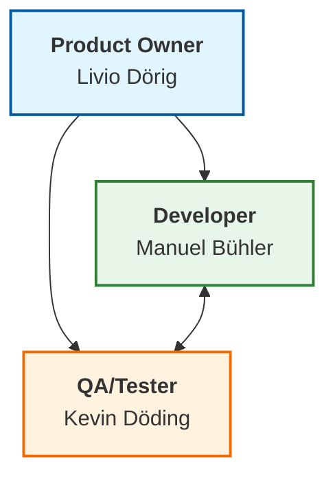

# Agenda App

Eine Svelte-App, erstellt mit `sv`.

## Teamzusammenstellung und Rollenzuweisung



## Entwicklung

Nachdem die Abhängigkeiten mit `npm install` (oder `pnpm install` oder `yarn`) installiert wurde, kann Entwicklungsserver gestartet werden:

```sh
npm run dev

# oder starten Sie den Server und öffnen Sie die App in einem neuen Browser-Tab
npm run dev -- --open
```
